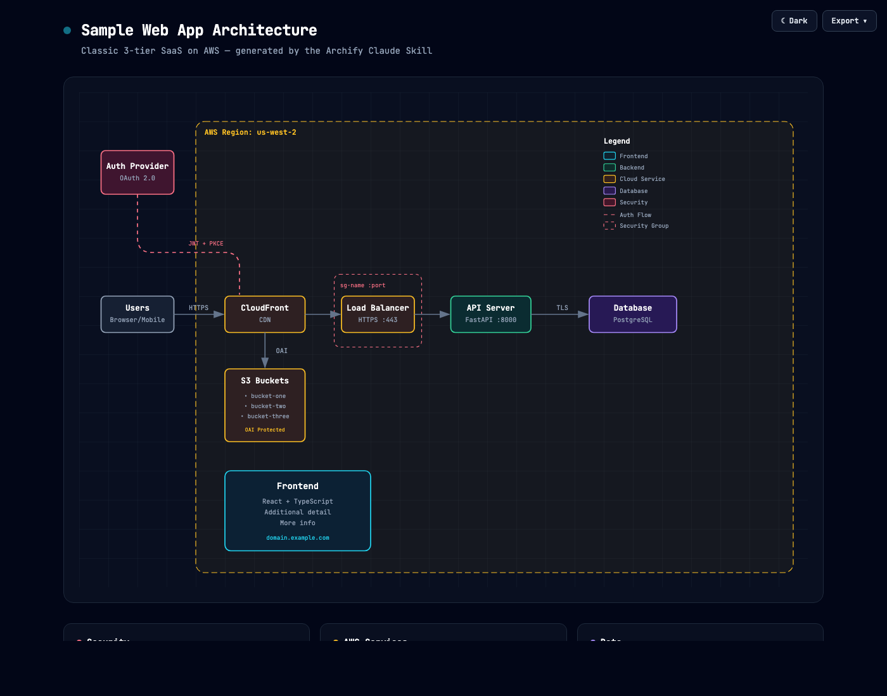
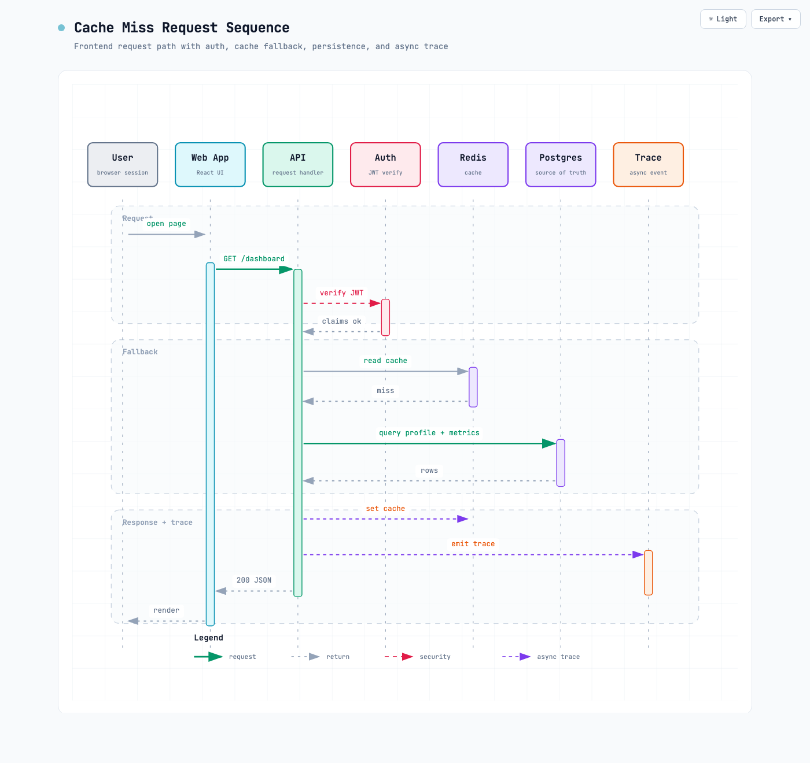
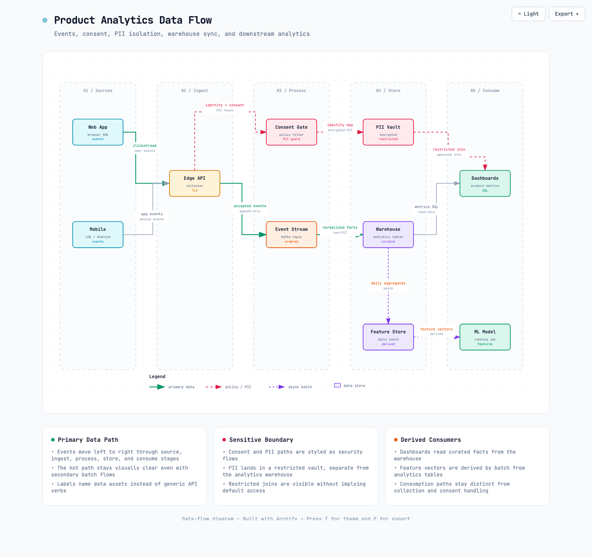
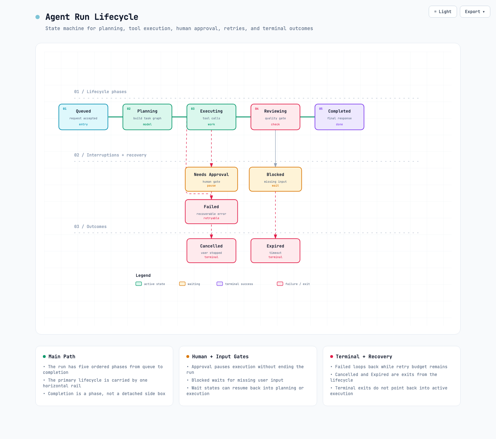

# Archify
<a href="https://trendshift.io/repositories/31352?utm_source=repository-badge&amp;utm_medium=badge&amp;utm_campaign=badge-repository-31352" target="_blank" rel="noopener noreferrer"></a>

**Generate beautiful architecture, technical workflow, sequence, data-flow, and lifecycle diagrams in chat. Switch dark / light. Copy to clipboard or export crisp up-to-4× PNG / JPEG / WebP / SVG.**

Archify is an agent skill for Claude, Codex CLI, and opencode. It turns a plain-English description of your system or process into a polished, self-contained technical diagram — a single HTML file you can open, toggle themes on, copy to the clipboard, and export at maximum resolution.

- **No design skills needed** — describe your architecture in English, get a diagram
- **Workflow, sequence, data-flow, and lifecycle diagrams too** — technical flows, approvals, tool calls, CI/CD, runbooks, request call chains, data pipelines, PII boundaries, and state machines can be drawn
- **Built-in theme toggle** — one click between dark and light, persists across sessions
- **Copy PNG to clipboard** — one click, paste straight into Slack / Notion / GitHub
- **Ultra-crisp image export** — PNG / JPEG / WebP rendered natively at up to 4× source resolution (no upsampling blur), or SVG for true vector
- **SVG follows system dark/light** — exported SVGs ship with both variable sets + `@media (prefers-color-scheme)`, so dropping one into a GitHub README makes it follow the reader's color preference (no more two PNGs wrapped in `<picture>`)
- **Validation loop built in** — renderer-backed diagrams go through JSON schema validation, layout checks, HTML/SVG artifact checks, and targeted iteration
- **Semantic tech labels** — describe components as `aws.lambda`, `postgres`, `redis`, `github-actions`, `openai`, etc.; Archify maps them to the right visual category without needing a full icon library
- **Self-contained HTML** — the generated file has zero dependencies, share by sending it
- **Iterate by chat** — "add Redis", "move auth to the left", "use emerald for the API"


**Project page:** [tt-a1i.github.io/archify](https://tt-a1i.github.io/archify/)

<p align="right"><a href="./README_ZH.md">中文</a></p>

**Start in 60 seconds:**

```bash
npx skills add tt-a1i/archify -g
```

Then ask your agent: `Use archify to map this repository's runtime architecture.`

## Preview

Same diagram, two themes, one click to switch:

| Dark | Light |
|---|---|
|  |  |

The Export menu — Copy PNG to clipboard plus 4 download formats (all raster exports at up to 4× source resolution):


Live example: [`examples/web-app.html`](examples/web-app.html) — open in a browser, press <kbd>T</kbd> to toggle theme, <kbd>E</kbd> to open Export. Append `?theme=light` or `?openExport=1` to the URL for deterministic screenshots.

## Diagram types

Archify now has five primary outputs:

| Type | Good for | How to ask |
|---|---|---|
| **Architecture** | System components, cloud resources, databases, caches, services, boundaries, security groups | Describe the system structure |
| **Workflow** | Request lifecycles, approval flows, tool calls, CI/CD, runbooks, incident response | Describe participants, step order, and key branches |
| **Sequence** | API call chains, request lifecycles, cache fallback, auth checks, async trace, service interactions | Describe who calls whom, in what order, and what returns |
| **Data Flow** | Data pipelines, ETL/ELT, analytics events, PII isolation, warehouse sync, lineage, downstream consumers | Describe sources, processing stages, storage, sensitivity boundaries, and consumers |
| **Lifecycle** | State machines, order/task/deployment/agent-run lifecycles, wait states, retries, cancellation, timeout, terminal states | Describe states, transition events, retry paths, and terminal outcomes |

Architecture diagrams explain system structure — components, boundaries, and how they connect:

```text
Use archify to draw an architecture diagram:
React frontend calls a Node.js API backed by PostgreSQL and Redis, deployed on AWS behind CloudFront.
```

Sample SaaS diagram: [`examples/web-app.html`](examples/web-app.html).

Real-repo examples (renderer-backed JSON IR):

- [`examples/archify-repo.html`](examples/archify-repo.html) — this project's skill → JSON IR → renderers pipeline
- [`examples/archify-repo-grid.html`](examples/archify-repo-grid.html) — same pipeline with `layout.mode: "grid"` (`row`/`col` placement)
- [`examples/maka-architecture.html`](examples/maka-architecture.html) — third-party desktop agent workbench (Maka)

Workflow is not trying to replace every general-purpose flowchart. It is a technical communication diagram: swimlanes, semantic colors, a clear happy path, and secondary async / approval / trace paths.

```text
Use archify to draw a workflow:
User submits a request -> Agent plans -> Approval Gate if needed -> Tool Call -> Trace Log -> Final Reply
```

Open the example here: [`examples/workflow-agent-tool-call-rendered.html`](examples/workflow-agent-tool-call-rendered.html).


Sequence diagrams explain a narrower interaction over time:

```text
Use archify to draw a sequence diagram:
User opens a page, the frontend calls the API, the API verifies JWT, reads Redis, falls back to Postgres on cache miss, returns JSON, and emits trace.
```

Open the example here: [`examples/sequence-cache-miss-request.html`](examples/sequence-cache-miss-request.html).



Data Flow diagrams explain how data assets move and change:

```text
Use archify to draw a data flow:
Web and Mobile emit analytics events, Edge API collects them, Consent Gate filters PII, Kafka carries accepted events,
Warehouse stores analytics tables, Feature Store derives daily features, Dashboards and an ML Model consume downstream data.
```

Open the example here: [`examples/dataflow-product-analytics.html`](examples/dataflow-product-analytics.html).



Lifecycle diagrams explain how an object changes state:

```text
Use archify to draw a lifecycle diagram:
Agent Run starts at Queued, moves through Planning, Executing, and Reviewing. It can pause at Needs Approval,
wait at Blocked, retry after Failed, end at Cancelled or Expired, or finish at Completed.
```

Open the example here: [`examples/lifecycle-agent-run.html`](examples/lifecycle-agent-run.html).



## What's new

Archify is based on [Cocoon-AI/architecture-diagram-generator](https://github.com/Cocoon-AI/architecture-diagram-generator) v1.0 (dark-only, HTML output). **2.0** rewrote the template around a themeable CSS-variable system and added a client-side export pipeline. **2.1** added copy-to-clipboard + keyboard nav. **2.2** added a print stylesheet + local-font fallback. **2.3** fixed the raster upsampling bug and made exports genuinely sharp at up to 4× source resolution. **2.4** upgraded SVG export to a dual-theme self-contained file. **2.5** added renderer-backed workflow / sequence / data-flow / lifecycle modes, Mermaid input guidance, CJK-aware text measurement, golden tests, and CI. **2.6** brought the architecture renderer to schema + layout validation parity. **2.7** hardens workflow diagrams with phase headers, groups, exception lanes, happy-path linting, same-lane orthogonal routing, and a post-render HTML/SVG checker. **2.8** adds opt-in trace animation and rejects workflow routes that cross unrelated nodes. **2.9** adds a unified CLI (`bin/archify.mjs`) and real-repo architecture examples. **2.10** adds actionable validator hints, optional architecture grid placement (`row`/`col`), and `archify inspect` for computed layout JSON.

| Feature | v1.0 | 2.0 | 2.1 | 2.2 | 2.3 | 2.4 | 2.5 | 2.6 | 2.7 | 2.8 | 2.9 | 2.10 |
|---|---|---|---|---|---|---|---|---|---|---|---|---|
| Dark theme | Yes | Yes | Yes | Yes | Yes | Yes | Yes | Yes | Yes | Same | Same | Same |
| Light theme | — | Toggle | Toggle | Toggle | Toggle + <kbd>T</kbd> shortcut | Same | Same | Same | Same | Same | Same | Same |
| PNG / JPEG / WebP download | manual screenshot | 2× bitmap-upsampled | 1× / 2× / 4× selector (still upsampled) | same | **4× rasterized natively — no blur** | Same | **Light-export lane colors fixed** | Same | Same | Same | Same | Same |
| SVG download | — | Vector, styles inlined (single theme) | Same | Same | Same | **Dual-theme self-contained** (`@media prefers-color-scheme`) | Same (lane colors fixed) | Same | Same | Same | Same | Same |
| Copy PNG to clipboard | — | — | Yes | Same | Yes (up to 4×) | Same | **Safari fix** | Same | Same | Same | Same | Same |
| Keyboard shortcuts | — | — | <kbd>T</kbd> / <kbd>E</kbd> + menu nav | Same | Same | Same | Same | Same | Same | Same | Same | Same |
| Accessibility | — | — | ARIA + focus-visible | Same | Same | Same | Same (+ menu a11y fixes) | Same | Same | Same | Same | Same |
| Print stylesheet | — | — | — | Yes | Yes (+ landscape + 2-col cards) | Same | Same | Same | Same | Same | Same | Same |
| Local-font fallback on export | — | — | — | Yes | Yes | Same | **+ CJK font fallback** | Same | Same | Same | Same | Same |
| Styling model | Inline `fill` / `stroke` | CSS custom properties + semantic classes | Same | Same | Same | Same | Same | Same | Same | Same | Same | Same |
| Typed renderers + schema validation | — | — | — | — | — | — | Workflow / sequence / data-flow / lifecycle | **+ architecture** | Same | Same | Same | Same |
| Workflow structure aids | — | — | — | — | — | — | Lanes + routed edges | Same | **Phases, groups, exception lanes, mainPath lint** | **Route-crossing guard** | Same | Same |
| Post-render artifact checker | — | — | — | — | — | — | — | — | **Yes** | Same | Same | Same |
| Trace animation | — | — | — | — | — | — | — | — | — | **Opt-in** | Same | Same |
| Unified CLI | — | — | — | — | — | — | — | — | — | — | **Yes** | Same |
| Real-repo architecture examples | — | — | — | — | — | — | — | — | — | — | **Yes** | Same |
| Architecture grid + layout inspect | — | — | — | — | — | — | — | — | — | — | — | **Yes** |
| Validator actionable hints | — | — | — | — | — | — | — | — | — | — | — | **Yes** |

## Quick start

### 1. Install in one command

Install Archify globally, then select your agent when prompted:

```bash
npx skills add tt-a1i/archify -g
```

Want to try it without a permanent install? This starts Codex with a temporary copy of the skill:

```bash
npx skills use tt-a1i/archify@archify --agent codex
```

Replace `codex` with `claude-code` or `opencode` to start either of those agents instead. These commands use the open-source [`skills` CLI](https://github.com/vercel-labs/skills).

### 2. Copy one prompt

**Map a real repository:**

```text
Analyze this repository, then use archify to create an architecture diagram of its runtime components, data flow, external dependencies, and trust boundaries.
```

**Explain a request path:**

```text
Use archify to draw this login flow: Browser -> Web App -> API -> JWT validation -> Redis session lookup -> PostgreSQL fallback. Show the cache-miss path clearly.
```

**Visualize delivery:**

```text
Use archify to create a CI/CD workflow diagram: pull request -> tests -> approval gate -> build image -> staging deploy -> smoke test -> production deploy, with rollback on failure.
```

The distributed skill includes standalone Schema validators, so it is ready to render immediately — no `npm install` or runtime dependencies required.

### 3. Iterate in chat

Ask for focused changes such as `add Redis`, `move auth to the left`, or `highlight the rollback path`. Archify returns a self-contained HTML file you can open in any browser and export as PNG, JPEG, WebP, or SVG.

### Other installation methods

Archify is packaged as an agent skill directory (`archify/SKILL.md`), so the same [`archify.zip`](archify.zip) works with Claude, Codex CLI, and opencode.

**Claude.ai:**
1. Download [`archify.zip`](archify.zip)
2. Go to **Settings** -> **Capabilities** -> **Skills**
3. Click **+ Add** and upload the zip file
4. Toggle the skill on

**Claude Code CLI:**
```bash
# Global (all projects)
unzip archify.zip -d ~/.claude/skills/

# Or project-local
unzip archify.zip -d ./.claude/skills/
```

**Codex CLI:**
```bash
# Global (all projects)
unzip archify.zip -d ~/.agents/skills/

# Or project-local
unzip archify.zip -d ./.agents/skills/
```

**opencode:**
```bash
# Global (opencode-native)
unzip archify.zip -d ~/.config/opencode/skills/

# Or project-local
unzip archify.zip -d ./.opencode/skills/

# Also works: the shared agent directory used above for Codex
unzip archify.zip -d ~/.agents/skills/
```

Renderer-backed diagrams follow a small quality loop before delivery:

| Step | What happens |
|---|---|
| **Generate JSON IR** | The agent writes a typed architecture / workflow / sequence / dataflow / lifecycle description instead of hand-editing the final SVG. |
| **Validate** | Bundled standalone validators check the JSON Schema with no runtime dependency installation. |
| **Render** | The typed renderer produces the self-contained HTML/SVG output. |
| **Check artifact** | The post-render checker catches malformed SVG, non-finite coordinates, accidental diagonal arrows, and legend-crossing routes. |
| **Iterate** | Fixes are made against the JSON IR or semantic classes, so targeted edits do not require regenerating the whole diagram from scratch. |

You can run the final artifact check directly:

```bash
node scripts/check-render-output.mjs output.html
```

The bundled CLI wraps the same renderer and checker commands:

```bash
node bin/archify.mjs doctor
node bin/archify.mjs demo /tmp/archify-demo
node bin/archify.mjs render workflow examples/agent-tool-call.workflow.json workflow.html
node bin/archify.mjs validate workflow examples/agent-tool-call.workflow.json --json
node bin/archify.mjs check workflow.html
node bin/archify.mjs examples
```

Renderer-backed diagrams can also opt into lightweight motion for demos:

```json
{ "meta": { "title": "Release Flow", "animation": "trace" } }
```

Trace animation runs inside the generated HTML/SVG: arrows flow in order, nodes pulse lightly, and `prefers-reduced-motion` disables movement for users who request it. Omit `animation` for the default static diagram.

**Claude.ai Projects (alternative):**
Upload [`archify.zip`](archify.zip) to your Project Knowledge.

What each install surface can do:

| Install surface | Capability |
|---|---|
| **Claude Code** | Full — runs the typed renderers + schema validation |
| **Codex CLI** | Full — install to `~/.agents/skills/` or `.agents/skills/` |
| **opencode** | Full — install to `.opencode/skills/`, `.agents/skills/`, or another supported skills directory |
| **Claude.ai (zip upload)** | Usually full — depends on whether the sandbox allows Node.js execution |
| **Project Knowledge** | Architecture mode only — no code execution, purely prompt-driven |

## Using the output

Open the generated HTML in any browser. Top-right you'll see two buttons:

- **Theme button** (Dark / Light) — one click flip, persisted across sessions. Shortcut: <kbd>T</kbd>.
- **Export menu** — opens a dropdown with five actions (Copy PNG + download PNG / JPEG / WebP / SVG). Shortcut: <kbd>E</kbd>.

### Export menu

| Action | What it does |
|---|---|
| **Copy PNG** | Puts a PNG of the current diagram straight on your clipboard. Paste into Slack, Notion, GitHub, Figma. |
| **Download PNG / JPEG / WebP** | Saves a raster image. JPEG/WebP are painted over the current theme's background (no alpha); PNG keeps transparency. |
| **Download SVG** | Vector export with all styles inlined, **dual-theme self-contained**. The file ships with both dark and light CSS variable sets plus a `@media (prefers-color-scheme)` rule — drop the same `.svg` into a GitHub README or blog and it follows the reader's preference automatically. Still editable in Figma / Illustrator. Scales losslessly. |

Every raster export (Copy PNG, Download PNG/JPEG/WebP) is rendered natively by the browser at **up to 4× the diagram's intrinsic resolution** (oversized diagrams step down to 3×/2× to stay within browser canvas limits) — the serialized SVG is given a `width`/`height` of `4 × viewBox`, rasterized by the browser at that resolution, and drawn to the canvas at natural size (no upsampling). This produces genuinely crisp output for retina displays, slides, and print. There is no scale dial — maximum safe sharpness is always chosen automatically.

### Keyboard

- <kbd>T</kbd> anywhere — toggle theme
- <kbd>E</kbd> anywhere — open the Export menu
- <kbd>↑</kbd> <kbd>↓</kbd> inside the menu — navigate actions
- <kbd>Home</kbd> / <kbd>End</kbd> — jump to first / last action
- <kbd>Enter</kbd> / <kbd>Space</kbd> — activate
- <kbd>Esc</kbd> — close menu

### URL parameters

- `?theme=light` or `?theme=dark` — force a starting theme (deterministic screenshots, share links, embeds)
- `?openExport=1` — auto-open the Export menu on load (demo / docs screenshots)

### Notes

- **WebP support** depends on your browser's canvas encoder. If unavailable (older Safari), the menu item is dimmed and disabled. PNG and JPEG are universal.
- **Clipboard support** for images requires `ClipboardItem` + `navigator.clipboard.write` (Chromium, Firefox 127+, Safari 16+). If unavailable, Copy PNG is dimmed.
- **Fonts in exports**: raster images use the system monospace fallback (`ui-monospace` / Menlo / Consolas) because the sandboxed image-rendering context can't fetch Google Fonts. Install JetBrains Mono locally for pixel-perfect rendering.

## Example prompts

**Web app:**
```
Create an architecture diagram for a web application with:
- React frontend
- Node.js/Express API
- PostgreSQL database
- Redis cache
- JWT authentication
```

**AWS serverless:**
```
Create an architecture diagram showing:
- CloudFront CDN
- API Gateway
- Lambda functions (Node.js)
- DynamoDB
- S3 for static assets
- Cognito for auth
```

**Microservices:**
```
Create an architecture diagram for a microservices system with:
- React web app and mobile clients
- Kong API Gateway
- User Service (Go), Order Service (Java), Product Service (Python)
- PostgreSQL, MongoDB, and Elasticsearch databases
- Kafka for event streaming
- Kubernetes orchestration
```

**Data flow / product analytics:**
```
Use archify to draw a data flow:
- Web App and Mobile SDK produce clickstream events
- Edge API collects events
- Consent Gate filters identity and PII
- Kafka/Event Stream carries accepted events
- Warehouse stores normalized facts
- Feature Store derives daily feature vectors
- Dashboards and ML Model consume downstream data
```

**State machine / lifecycle:**
```
Use archify to draw a lifecycle diagram:
- A task starts at Queued
- Planning builds the plan
- Executing calls tools
- Reviewing checks quality
- Needs Approval and Blocked are wait states
- Failed can retry, while Cancelled / Expired / Completed are terminal states
```

## Color palette

| Component Type | Color   | Use for                           |
| -------------- | ------- | --------------------------------- |
| Frontend       | Cyan    | Client apps, UI, edge devices     |
| Backend        | Emerald | Servers, APIs, services           |
| Database       | Violet  | Databases, storage, AI/ML         |
| Cloud / AWS    | Amber   | Cloud services, infrastructure    |
| Security       | Rose    | Auth, security groups, encryption |
| Message Bus    | Orange  | Kafka, RabbitMQ, SNS, event buses |
| External       | Slate   | Generic, external systems         |

Each color has coordinated dark-mode and light-mode variants that switch together via the theme toggle.

### Semantic tech labels

Archify is not trying to ship a complete AWS / Azure / GCP icon runtime. Instead, it treats technology names and optional labels as semantic hints that guide color, grouping, and copy:

| Label examples | Visual category |
|---|---|
| `react`, `nextjs`, `ios`, `android`, `browser` | Frontend |
| `node`, `go-service`, `python-worker`, `api-gateway` | Backend |
| `postgres`, `mysql`, `redis`, `s3`, `bigquery`, `snowflake` | Database / storage |
| `aws.lambda`, `aws.cloudfront`, `gcp.pubsub`, `azure.functions`, `kubernetes` | Cloud / infrastructure |
| `auth0`, `cognito`, `oauth`, `vault`, `security-group` | Security |
| `kafka`, `rabbitmq`, `sns`, `sqs`, `nats` | Message bus |
| `stripe`, `github-actions`, `openai`, `anthropic`, `slack` | External |

Use these labels in prompts or JSON IR when the exact technology matters. The generated diagram stays self-contained HTML/SVG; the labels improve semantic styling and layout without forcing a heavyweight icon dependency.

## Technical details

- **Styling:** CSS custom properties on `:root` + `[data-theme="light"]`; SVG elements reference semantic classes (`c-frontend`, `t-muted`, `a-emphasis`, etc.). Toggling `data-theme` on `<html>` re-themes the entire diagram including gradient, grid, arrows, and mask rects.
- **Export pipeline:** The SVG is cloned, host `<style>` is inlined, and current theme variables are resolved and written into a `:root` rule on the clone. For raster formats the clone's `width`/`height` are set to `4 × viewBox` so the browser rasterizes the vectors at target resolution natively; the canvas is sized to match and the image is drawn at natural size (no bitmap upsampling). `toBlob(mime)` then produces the file. JPEG gets an explicit background fill since it has no alpha. If the target resolution would exceed the browser's canvas limits, the pipeline automatically falls back to 3× or 2× so the export still succeeds.
- **Self-contained output:** Single HTML file, Google Fonts link + inline SVG + ~19 KB of embedded JS. No build step, no JS framework, no server. The generated HTML and the distributed renderer have zero runtime dependencies.
- **Output checks:** `bin/archify.mjs validate`, renderer layout checks, and `scripts/check-render-output.mjs` validate generated diagrams before delivery: schema validity, finite SVG values, no accidental two-point diagonal arrows, and no arrow segments crossing the legend.
- **Browser support:** Any modern browser (Chrome, Safari, Firefox, Edge). Needs `Image` + `canvas.toBlob` with `image/webp` support for WebP export.

## Attribution

Archify is a fork / rewrite of [**Cocoon-AI/architecture-diagram-generator**](https://github.com/Cocoon-AI/architecture-diagram-generator) (MIT, v1.0) by [Cocoon AI](mailto:hello@cocoon-ai.com). The original's clean visual design — color palette, grid background, summary-card layout, JetBrains Mono typography — is preserved. All credit for the original aesthetic belongs to them.

Archify 2.x contributes:
- Refactor of the template to a CSS-variable theme system (dark + light)
- Theme toggle + `localStorage` persistence + `prefers-color-scheme` default
- Built-in PNG / JPEG / WebP / SVG export menu + copy to clipboard
- 4× native rasterization (fixes upsampling blur)
- Dual-theme self-contained SVG export (single file follows the host's `prefers-color-scheme`)
- Keyboard navigation + accessibility semantics
- Print stylesheet + local-font fallback
- Renderer-backed architecture, workflow, sequence, data-flow, and lifecycle diagrams with schema validation
- Post-render artifact checks for final HTML/SVG quality
- Unified CLI (`bin/archify.mjs`) for render / validate / check / examples
- Real-repo architecture examples (`archify-repo`, `maka-architecture`)
- Updated `SKILL.md` to guide Claude toward class-based (themeable) diagrams

Both projects are MIT-licensed.

## Roadmap

See [ROADMAP.md](ROADMAP.md).

Next up is **v3.0 — JSON IR stabilization**: a minimal `diagram.json` intermediate format so Claude can make local coordinate edits without drifting unrelated components, with `git diff`-friendly output and theme/palette swaps that don't require re-rendering.

> **About Mermaid import:** the automatic Mermaid parser route was cut after an experiment showed that auto-layout + archify CSS doesn't look meaningfully better than native Mermaid ([experiments/v3-mermaid-validation/RESULT.md](experiments/v3-mermaid-validation/RESULT.md)). Archify's aesthetic core is Claude's layout judgment, not the CSS. You can still paste Mermaid code and have Claude lay out an archify-style diagram from scratch — it goes through the `SKILL.md` prompts, not a parser.
>
> The former v2.4 / v2.5 plans (`?exportScale=N`, color-blind palettes, share links) were also dropped. See the [ROADMAP "Not planned" section](ROADMAP.md#not-planned) for the rationale.

## License

[MIT](LICENSE) — free to use, modify, and distribute.

## Contributing

Issues, PRs, and shared diagrams welcome.
